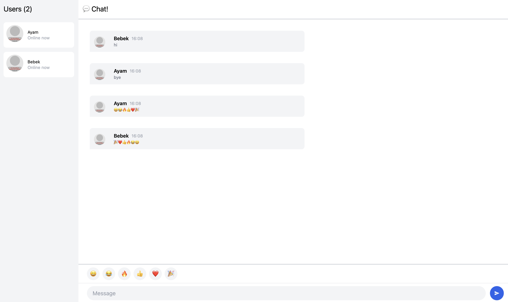

## Experiment 3.1: Original Code

## Experiment 3.2: Creative Improvements

The register page was simplified into a clean centered card with a nickname input and a Join Chat button. This makes the first screen easier to understand before entering the chat room.

In the chat page, I added emoji buttons so users can quickly use the emojis for their message. I also added a timestamp beside each sender name so every message shows when it was sent.

I also made two small behavior improvements, empty messages are not sent, and the sidebar now shows the number of online users with a label such as Users (2).
